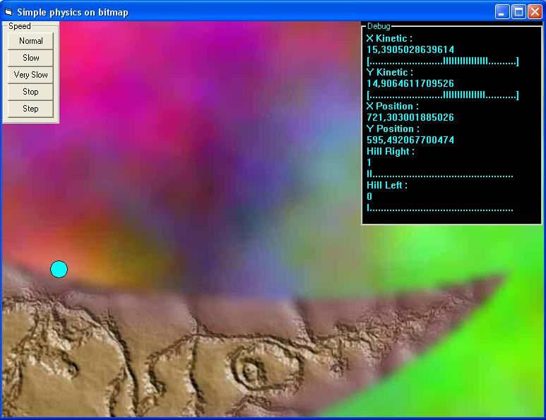



## Physics on bitmap

### Description

We all sean simple phisics endgines in VB work whith balls in a sqare box(Form).Boxes are too boring to me so i made one that works on a bitmap mask.

I was too lazy to put in some good graphics code so i just used a picturebox,wich was amazingly fliker free.

Also a good feture in it is drawing walls while simulation is runing.

Camera auto scrools to the ball when simulation is runing its movement is also smothend by a simple eqasion.

Comands:

Left Click = draw wall

Left Click + Shift = erase wall (caution: this works on exsiting mask too)

Midle Click+ Drag = Scroll

Right Click = move ball to cursor

Oh and leave some coments.
 
### More Info
 

             |
---                |---
**Submitted On**   |2006-11-13 12:50:02
**By**             |[Berni](https://github.com/Planet-Source-Code/PSCIndex/blob/master/ByAuthor/berni.md)
**Level**          |Intermediate
**User Rating**    |4.7 (14 globes from 3 users)
**Compatibility**  |VB 5\.0, VB 6\.0
**Category**       |[Math/ Dates](https://github.com/Planet-Source-Code/PSCIndex/blob/master/ByCategory/math-dates__1-37.md)
**World**          |[Visual Basic](https://github.com/Planet-Source-Code/PSCIndex/blob/master/ByWorld/visual-basic.md)
**Archive File**   |[Physics\_on20307011132006\.zip](https://github.com/Planet-Source-Code/berni-physics-on-bitmap__1-67077/archive/master.zip)

